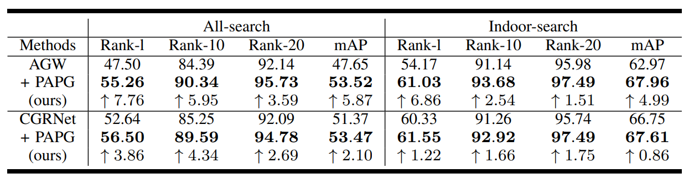

### Pose Attention-guided Paired-images Generation for Visible-Infrared person Re-identification（PAPG for VI-ReID）

Pytorch Code of PAPG for VI-ReID on SYSU-MM01dataset and RegDB dataset. 


#### 1. Prepare the datasets.

- RegDB Dataset: The RegDB dataset can be downloaded from this [website](http://dm.dongguk.edu/link.html) by submitting a copyright form.
  - run `python ./make_pose/pre_process_regdb.py` in to pepare the dataset, the training data will be stored in ".npy" format.
- SYSU-MM01 Dataset: The SYSU-MM01 dataset can be downloaded from this [website](http://isee.sysu.edu.cn/project/RGBIRReID.htm).
  - run `python ./make_pose/pre_process_sysu.py` in to pepare the dataset, the training data will be stored in ".npy" format.

- Coordinate: run `python ./make_pose/compute_coordinates.py` to obtain the coordinates of 18 joint points of the human body.
- Pose image: run `python ./make_pose/pose_utils.py` to obtain pose images of the human body.

#### 2. Training.

Train a model by

```bash
python train.py --cuda --dataset sysu --lr 0.0002 --batchSize 1 --gpu 0 --add_pose on --add_att on
```

- `--dataset`: which dataset "sysu" or "regdb".
- `--lr`: initial learning rate.
- `--gpu`: which gpu to run.
- `--add_pose`: whether to use pose-guided to train the model.
- `--add_att`:whether to use attention block.

You may need to manually define the Dataset path first.

*Training log*: The training log will be saved in `log/`. Model will be saved `output/`.

#### 3. Testing.

Generate cross-modality paired-images on SYSU-MM01 or RegDB dataset.

```bash
python test.py --cuda --gpu 0 --dataset sysu --add_att on --add_pose on
```

* `--dataset`: which dataset "sysu" or "regdb".
* `--gpu`: which gpu to run.
* `--add_pose`: whether to use pose-guided to train the model.
* `--add_att`:whether to use attention block.

You may need to manually define the Model path first.

*Testing log*: The generated paired-images are saved in `output/A` and `output/B` respectively.

#### 4. Experimental Results.

* Applicability to other VI-ReID methods.



#### 5. References.

```bash
[1]Ye, Mang and Shen, Jianbing and Lin, Gaojie and Xiang, Tao and Shao, Ling and Hoi, Steven CH. Deep learning for person re-identification: A survey and outlook. IEEE transactions on pattern analysis and machine intelligence, vol. 44, pp.2872--2893, 2021
```

```bash
[2]Feng, Yujian and Chen, Feng and Ji, Yi-mu and Wu, Fei and Sun, Jing. Efficient cross-modality graph reasoning for RGB-infrared person re-identification. IEEE Signal Processing Letters, vol. 28, pp.1425--1429, 2021.
```

```bash
[3]Qian, Yongheng and Yang, Xu and Tang, Su-Kit. Dual-Space Aggregation Learning and Random Erasure for Visible Infrared Person Re-Identification. IEEE Access, vol.11, pp.75440-75450, 2023.
```

